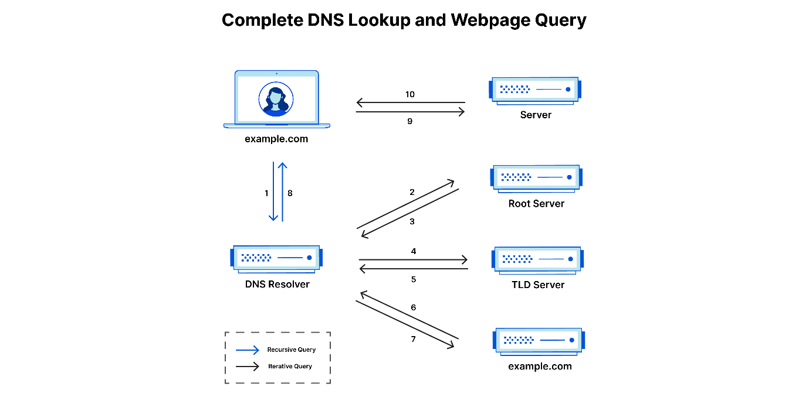
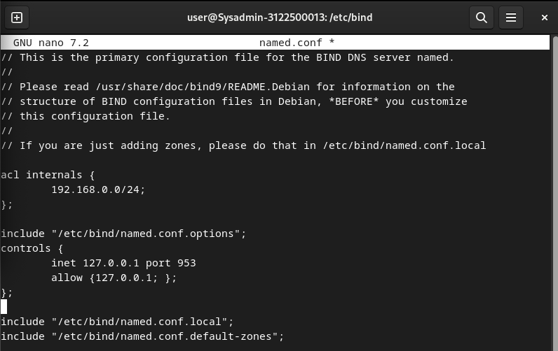
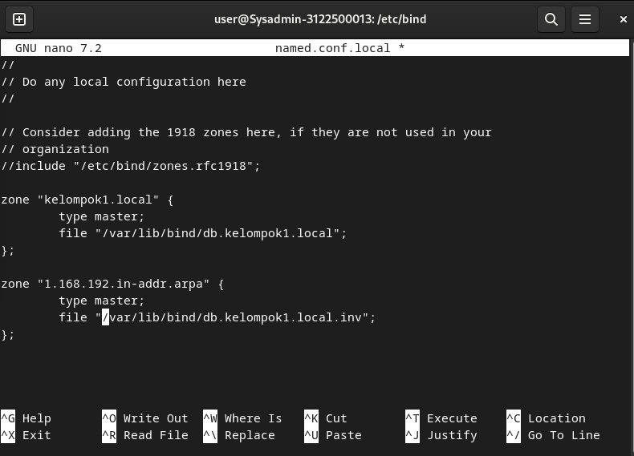
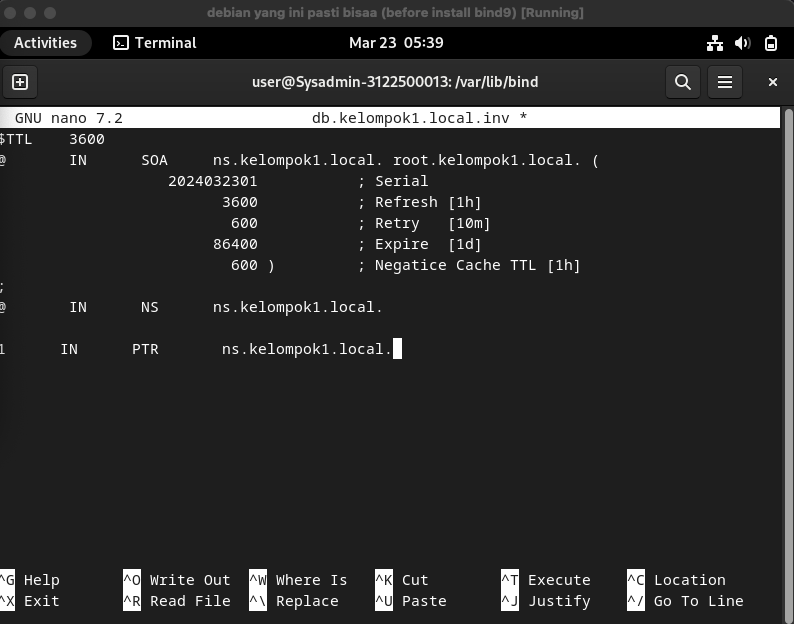
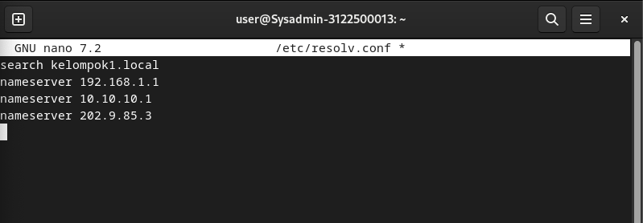
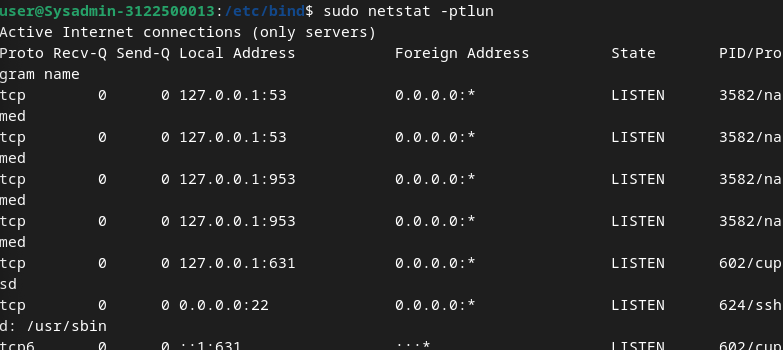
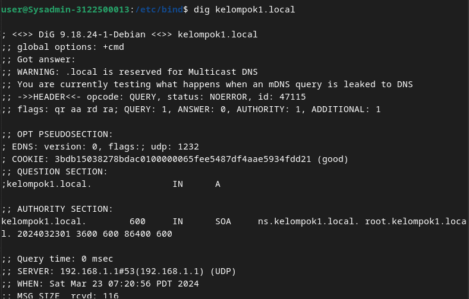

<div align="center">
  <h1 style="text-align: center;font-weight: bold">LAPORAN WORKSHOP ADMINISTRASI JARINGAN<br>Tugas 4</h1>
  <h4 style="text-align: center;">Dosen Pengampu : Dr. Ferry Astika Saputra, S.T., M.Sc.</h4>
</div>
<br />
<div align="center">
  
  <h3 style="text-align: center;">Disusun Oleh : <br>Kelompok 1</h3>
  <p style="text-align: center;">
    <strong>Mahendra Khibrah Rabbani Sayyid (3122500013)</strong><br>
    <strong>Akmal Zidani Fikri (3122500019)</strong><br>
    <strong>Bagus Bimo Prakoso (3122500028)</strong>
  </p>

<h3 style="text-align: center;line-height: 1.5">Politeknik Elektronika Negeri Surabaya<br>Departemen Teknik Informatika Dan Komputer<br>Program Studi Teknik Informatika<br>2023/2024</h3>
<hr>
<hr>
</div>

## 1. Tugas Baca tentang Ekosistem Internet (Materi sudah diunggah di Ethol). Tuliskan pendapatmu tentang bagaimana Internet bekerja (tugas pribadi)!

## 2. Bagaimana Cara kerja dari iterative dan recursive dari DNS Query, ada 8 step, dari PC anda!

### Misal dari BBC.com

**1. Pengguna mengetikkan alamat \"bbc.com\" di browser.**

**2. Browser mengirimkan permintaan DNS ke resolver DNS lokal yang
terhubung ke internet.**

**3. Resolver DNS lokal tidak memiliki informasi alamat IP untuk
\"bbc.com\", sehingga memulai proses pencarian.**

**4. Pencarian Iteratif:**

- Resolver DNS lokal bertanya kepada salah satu dari 13 root server
  global.

- Root server memberikan informasi tentang server TLD (Top-Level
  Domain) yang bertanggung jawab atas \".com\".

**5. Pencarian Rekursif:**

- Resolver DNS lokal kemudian bertanya kepada server TLD \".com\".

- Server TLD \".com\" memberikan informasi tentang server DNS yang
  memiliki informasi tentang \"bbc.com\".

- Resolver DNS lokal kemudian bertanya kepada server DNS yang
  disediakan oleh registrar domain bbc.com.

**6. Server DNS bbc.com memberikan alamat IP untuk bbc.com.**

**7. Resolver DNS lokal menerima alamat IP dari server DNS bbc.com.**

**8. Resolver DNS lokal meneruskan alamat IP ke browser.**

**Penjelasan Singkat:**

- **Resolver DNS lokal:** Perantara yang menerjemahkan nama domain
  seperti \"bbc.com\" ke alamat IP.

- **Root server:** Server yang menyimpan informasi tentang server TLD.

- **Server TLD:** Server yang bertanggung jawab atas domain tingkat
  atas seperti \".com\".

- **Server DNS registrar:** Server yang menyimpan informasi tentang
  nama domain dan alamat IPnya.



**Sumber:** <https://www.cloudflare.com/learning/dns/what-is-dns/>

## Parafrase Analogi Pencarian Alamat Situs Web

**Analogi:**

Proses mencari alamat situs web bbc.com diibaratkan seperti mencari
alamat rumah seseorang di kota yang tidak pernah Anda kunjungi
sebelumnya.

**Langkah-langkah:**

**1. Permintaan Awal:**

- Inginkan kunjungi rumah seorang teman di kota yang tak dikenal.

- Hanya punya nama teman (bbc.com) tanpa tahu alamatnya (alamat IP).

**2. Pertanyaan Pertama:**

- Tanyakan kepada penduduk kota.

- Mereka tidak tahu alamat teman, tapi arahkan ke pusat informasi kota
  (root server) untuk info lebih lanjut.

**3. Pusat Informasi Kota (Root Server):**

- Di sana, petugas arahkan ke wilayah yang relevan (TLD server).

**4. Wilayah (TLD Server):**

- Pergi ke wilayah sesuai petunjuk.

- Tanyakan penduduk di sana.

- Mereka arahkan ke institusi terkait (DNS server yang mengelola
  domain \".com\").

**5. Kantor Polisi (DNS Server .com):**

- Di sana, diberitahu untuk langsung tanyakan keluarga teman (DNS
  server bbc.com).

**6. Rumah Teman (DNS Server bbc.com):**

- Di sana, anggota keluarga berikan alamat lengkap teman.

**7. Kembali ke Anda:**

- Kembali dengan alamat lengkap yang diberikan oleh keluarga teman.

**8. Tiba di Rumah Teman:**

- Kunjungi teman dengan alamat yang diperoleh dan tiba di rumahnya.

## 3. Ikuti langkah-langkah instalasi DNS server dengan menggunakan aplikasi BIND9 pada Debian 12 anda [BIND9-debian-wiki](https://wiki.debian.org/Bind9#Debian_Bookworm)


Proses intalasi paket yang diperlukan

Bind9 → paket utama untuk menyediakan dns server

Bind9-doc → paket yang berisikan dokumentasi mengenai bind9

Bind9-dnsutils → paket yang berisikan utils untuk mengelola bind9 salah
satunya nslookup



Konfigurasi utama bind9 yang ada di /etc/bind

Acl internals {} untuk memberikan akses kontrol pada dns server secara
internal pada ip tertentu.

Controls {} digunakan untuk memberikan akses pada ip dan port tertentu
untuk mengakses dns dari eksternal

Didalam konfigurasi utama, memanggil juga konfigurasi lainnya yaitu
options local dan default zone


Pada konfigurasi options mengatur izin seperti allow query dan
recursion. Pada kasus ini izin diberikan kepada internals yang ada di
named.conf sebelumnya.

Untuk listen-on untuk mengatur mana koneksi alamat ip yang didengar



Pada file konfigurasi conf.local mengatur zone file yang kita simpan.

Contoh pada gambar adalah mengatur zone file kelompok1.local sebagai
domain name yang ada pada file di /var/lib/bind/db.kelompok1.local,
begitu juga alamat ip terbalik.


Cek apakah konfigurasi ada error atau tidak, jika tidak ada maka error
tidak ditemukan


Pada /var/lib/bind buat file db sesuai yang sudah ada di konfigurasi
zone file sebelumnya. Contoh diatas adalah db.kelompok1.local


Ini adalah isi dari file kelompok1.local

Menyimpan serial dimana best practice nya adalah tahunBulanTanggalVersi

Di file ini mengambil dari host ns.kelompok1.local.

Untuk address nya menuju pada alamat ip 192.168.1.1

Untuk www dan mail kita aliaskan sama untuk ns



Ini adalah isi dari file kelompok1.local.inv

Disini menyimpan alamat ip, pada kasus ini adalah 1 yang mengarah ke
(pointer to) ns.kelompok1.local.


Named-checkzone adalah utils yang digunakan untuk mengecek apakah
konfigurasi sudah benar.

Pada kasus ini domain name dicek apakah sudah benar, jika status 'OK'
artinya sudah terkonfigurasi dengan benar. Begitu pula untuk alamat ip
192.168.1



Setelah itu konfigurasi file /etc/resolv.conf

Ini adalah konfigurasi untuk sistem dns pada linux

Pada kasus ini ketika search kelompok1.local maka akan mencari ke
nameserver utama 192.168.1.1, jika tidak merespons atau tidak ada maka
akn mencari di alamat ip cadangannya yaitu 2 baris bawahnya.


Restart konfigurasi bind9 pada named.conf, lalu lihat statusnya, jika
active artinya sudah berjalan



cek menggunakan sudo netstat -ptlun untuk
melihat apakah port dns 192.168.1.1 (53) sudah terbuka. Jika ada artinya
sudah terbuka



<br>

<br>


Menggunakan perintah nslookup dan dig untuk memerika apakah dns server
bisa mememberi jawaban. Pada kasus ini kelompok1.local memiliki ip
192.168.1.1

```

```
