

  <h1 style="text-align: center;font-weight: bold">LAPORAN WORKSHOP ADMINISTRASI JARINGAN Tugas 5</h1>
  <h4 style="text-align: center;">Dosen Pengampu : Dr. Ferry Astika Saputra, S.T., M.Sc.</h4>

 

  
  <h3 style="text-align: center;">Disusun Oleh :  Kelompok 1</h3>
  

    <strong>Akmal Zidani Fikri (3122500019)</strong> 
  

<h3 style="text-align: center;line-height: 1.5">Politeknik Elektronika Negeri Surabaya Departemen Teknik Informatika Dan Komputer Program Studi Teknik Informatika 2023/2024</h3>

Note : Hasil screenshot step by step mungkin ada beberapa yang kurang
sesuai dengan instalasi yang fresh pertama kali dikarenakan proses
screenshot baru saja saya lakukan setelah saya memastikan berhasil semua
step hingga tujuan akhir yaitu web mail + roundcube berhasil dibuat dan
digunakan. Sehingga banyak step by step seperti instalasi package dan
aktivasi config berisi already enable atau already installed

Pastikan BIND9 pada praktikum sebelumnya sudah terinstall dan
terkonfigurasi sesuai dengan custom domain kelompok.

Kembalikan virtualBox dalam keadaan Network NAT dan IP DNS Automatic
agar terkoneksi dengan internet.

  

## Konfigurasi NTP Client

Jika sudah terkoneksi dengan internet, lakukan instalasi package

`sudo apt install systemd-timesyncd`

  

Konfigurasi timezone ke Asia/Jakarta, RTC ke UTC, aktivasi NTP Client,
dan edit conf

  

  

Conf diset agar NTP server mendapatkan waktu delay terpendek, Write Out
lalu exit.

Restart timesyncd dan cek status

  

## Instalasi dan Konfigurasi Apache 2

Instal package Apache 2

`sudo apt -y install apache2`

  

Konfigurasi apache2

  

  

  

  

  

Pergi ke line 70

  

  

  

Restart apache2

  

Lalu tes ke domain yang sudah diset sebelumnya di kelompok1.local

Tapi sebelumnya ubah dulu IP dan DNS sesuai dengan yang sudah diset
sebelumnya

  

Jangan lupa setelah mengubah IP dan DNS untuk refresh dengan cara on/off
switch Internet

  

Apache berhasil diakses

  

## Instalasi PHP 8.2

Karena instalasi package maka kembalikan lagi IP dan DNS menjadi
automatic agar tersambung koneksi internet

`sudo apt -y install php8.2 php8.2-mbstring php-pear`

  

Cek apakah sudah terinstal atau belum dengan cek version php

  

  

## Instalasi dan Konfigurasi PHP-FM

`sudo apt -y install php-fpm`

  

Konfigurasi PHP-FM pada file config Apache

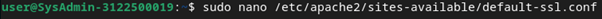  

  

Aktivasi modul dan konfig

  

Test validasi PHP-FM

Masuk ke root superuser lalu lakukan seperti dibawah ini

`echo '\<?php phpinfo(); ?\>' \> /var/www/html/info.php`

  

Test di browser

Jangan lupa kembalikan ke IP dan DNS manual dan refresh dengan on/off
switch internet

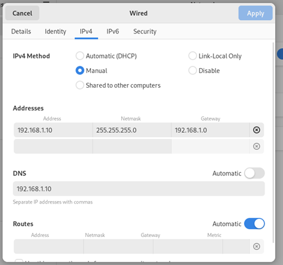  

  

Berhasill…

## Instalasi dan Konfigurasi Database System : MariaDB

Set IP dan DNS auto kembali untuk melakukan instalasi MariaDB.

`sudo apt -y install mariadb-server`

  

Pastikan charset default seperti dibawah ini

  

  

Lalu restart mariadb

  

Konfigurasi mariadb

  

  

Test konek ke mariadb

  

  

  

  

Berhasil…

## Instalasi dan Konfigurasi Email System POSTFIX : SMTP Server

`sudo apt -y install postfix sasl2-bin`

  

Pilih No Configuration tekan enter

  

Konfigurasi POSTFIX

  

Pergi ke line 82

  

Pergi ke line 98

  

Pergi ke Line 106

  

Pergi ke line 127

  

Pergi ke line 141

  

Pergi ke line 189

  

Pergi ke line 232

  

Pergi ke line 277

  

Pergi ke line 294

  

Pergi ke line 416

  

Pergi ke line 427

  

Pergi ke line 449

  

Pergi ke line 585

  

Pergi ke line 659, 664, 669, 675

  

Pergi ke line 679, 683, 688, 692 dan Comment

  

Pada line terakhir tambahkan command dibawah ini

\# disable SMTP VRFY command  
disable_vrfy_command = yes

\# require HELO command to sender hosts  
smtpd_helo_required = yes

\# limit an email size  
\# example below means 10M bytes limit  
message_size_limit = 10240000

\# SMTP-Auth settings  
smtpd_sasl_type = dovecot  
smtpd_sasl_path = private/auth  
smtpd_sasl_auth_enable = yes  
smtpd_sasl_security_options = noanonymous  
smtpd_sasl_local_domain = $myhostname  
smtpd_recipient_restrictions = permit_mynetworks,
permit_auth_destination, permit_sasl_authenticated, reject

  

WriteOut dan Exit

  

Menambahkan konfigurasi anti spam

Pada line terakhir tambahkan command dibawah ini

\# reject unknown clients that forward lookup and reverse lookup of
their hostnames on DNS do not match

smtpd_client_restrictions = permit_mynetworks,
reject_unknown_client_hostname, permit

\# rejects senders that domain name set in FROM are not registered in
DNS or

\# not registered with FQDN

smtpd_sender_restrictions = permit_mynetworks,
reject_unknown_sender_domain, reject_non_fqdn_sender

\# reject hosts that domain name set in FROM are not registered in DNS
or

\# not registered with FQDN when your SMTP server receives HELO command

smtpd_helo_restrictions = permit_mynetworks, reject_unknown_hostname,
reject_non_fqdn_hostname, reject_invalid_hostname, permit

  

  

WriteOut dan exit

Lalu restart postfix

  

## Instalasi dan Konfigurasi Dovecot Server

`sudo apt -y install dovecot-core dovecot-pop3d dovecot-imapd`

  

Konfigurasi Dovecot

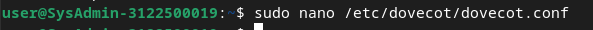  

Pergi ke line 30

  

  

Pergi ke line 10

  

Pergi ke line 100

  

  

Pergi ke line 30

  

  

Pergi ke line 107

  

Lalu Restart dovecot

  

Check Services

  

Cek layanan Postfix

Dibawah 220 …. Ketikkan `ehlo mail kelompok1.local`

  

## Instalasi PHP MyAdmin

`sudo apt install phpMyAdmin`

  

Pilih Apache2

  

Pilih yes

  

Kosongi password langsung OK

  

Konfigurasi PHP MyAdmin pada Apache2

  

  

Lalu coba create user dan password (123)

  

Restart MariaDB dan PHP

  

Lalu test ke browser

Jangan lupa ubah IP dan DNS manual sesuai dengan yang diset sebelumnya

BERHASIL..

  

Coba login dengan user yang telah dibuat tadi user/123

  

## Instalasi Thunderbird

Set IP dan DNS menjadi Auto untuk instalasi package

`sudo apt-get install thunderbird`

  

Mencoba membuat 2 user bernama akmal dan mahen  
disini password saya set 123 semua agar mudah diingat

  

Mencoba login menggunakan user yang telah dibuat

Set IP dan DNS menjadi manual

  

  

  

  

  

  

  

Berhasil ….

## Instalasi dan konfigurasi Roundcube

Set IP dan DNS ke Automatic untuk instalasi package yang membutuhkan
koneksi internet

`sudo apt install roundcube roundcube-mysql`

  

Konfigurasi roundcube

disini saya set password 123

  

Sesuaikan password pada file konfig DB roundcube

  

  

Sesuaikan dengan IP yang kita set sebelumnya

  

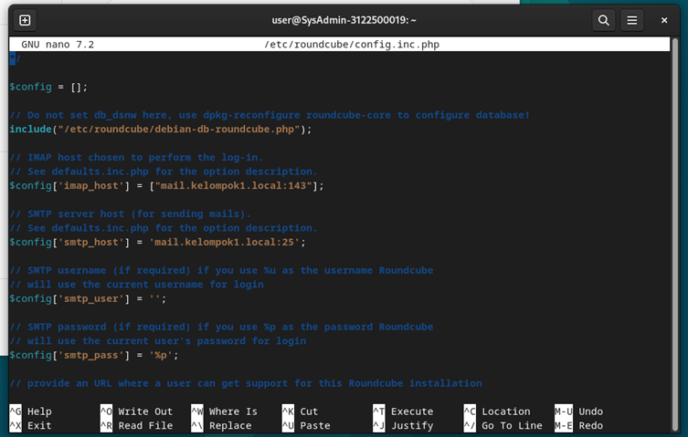  

Konfigurasi roundcube pada Apache

  

Coba Roundcube

Set IP dan DNS manual kembali agar terkonek dengan server yang kita buat

  

Yeay sudah berhasil

  

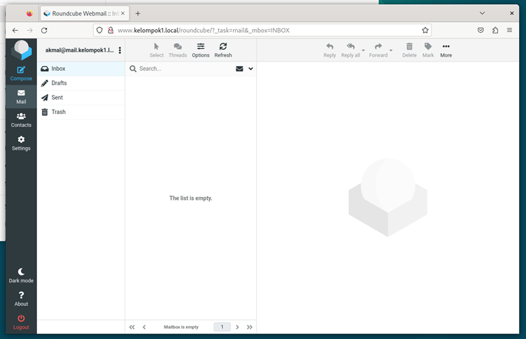  

## Simulasi mengirim pesan melalui email

Disini saya login menggunakan user akmal/123 pada RoundCube
  

dan user mahen/123 pada ThunderBird
  
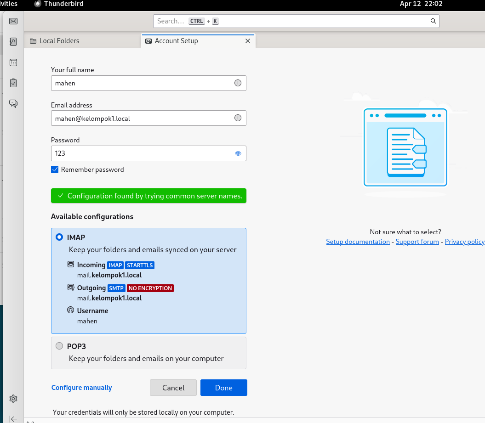  
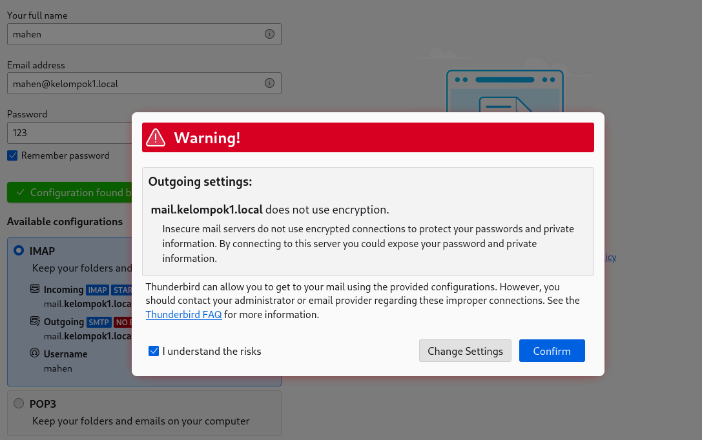  
  

Berhasil login mahen@kelompok1.local pada ThunderBird
  

Sekarang pada RoundCube user akmal@kelompok1.local mencoba kirim pesan ke mahen@kelompok1.local

Klik Compose
  

Masukkan pesan dan email tujuan, jika sudah klik Send
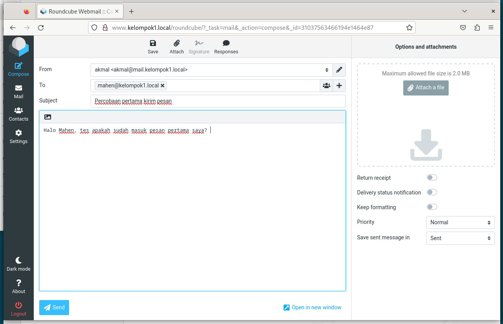  

Muncul Notifikasi Message sent successfully dan muncul notifikasi ThunderBird
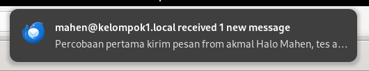  

Cek pada ThunderBird user mahen dan pesan dari user akmal sudah masuk
  

Sekarang pada ThunderBird user mahen mencoba membalas pesan akmal, klik Reply to Sender Only
  

Lalu klik send
  

Cek RoundCube, jika belum masuk klik refresh pada browser
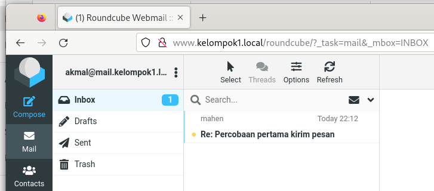  
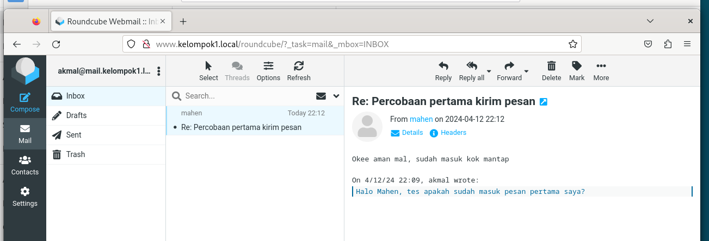  
Pesan berhasil masuk!
